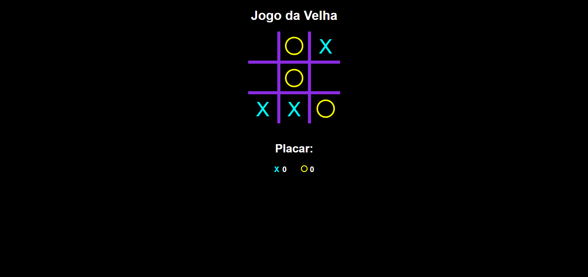

#  Jogo da Velha 

Projeto de Jogo da Velha desenvolvido com **HTML, CSS e JavaScript puro**, com modo **Multiplayer** e **IA (computador)**.

## Funcionalidades
- Modo jogador vs jogador
- Modo jogador vs computador (IA)
- Sistema de pontuação
- Detecção de vitória e empate
- Interface simples e responsiva

## Lógica da IA
A IA possui lógica para:
- Ganhar quando possível
- Bloquear jogadas do jogador
- Priorizar o centro
- Jogadas aleatórias para variar a dificuldade

## Tecnologias utilizadas
- HTML5
- CSS3
- JavaScript (Vanilla JS)

## Preview
- Seleção de modo de jogo

- Jogo em andamento


## Demo
https://HerculeGarrido.github.io/jogo_da_velha/

## Como executar o projeto
1. Clone o repositório
```bash
git clone https://github.com/HerculeGarrido/jogo_da_velha.git
